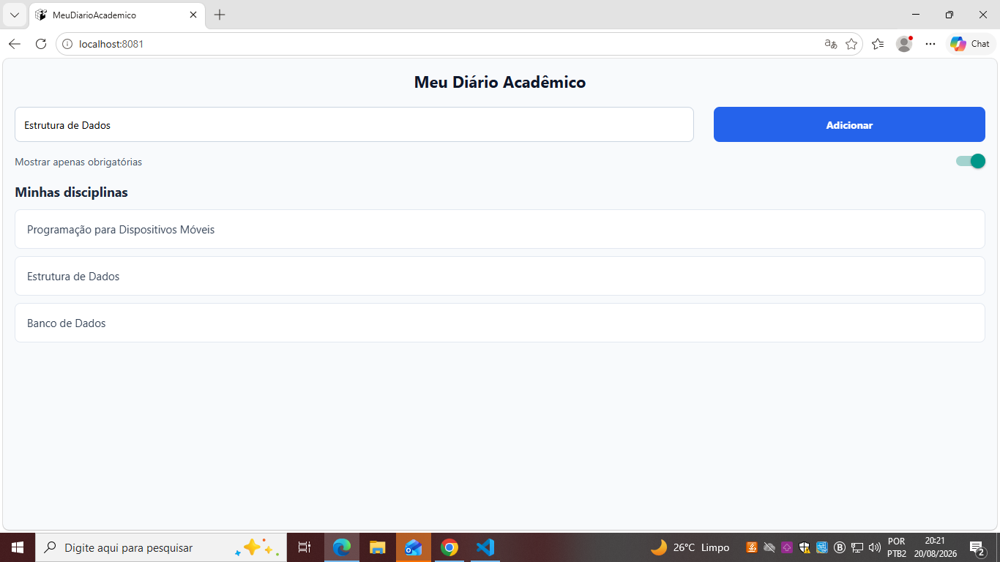

# MeuDiarioAcademico - Atividade 01

**Disciplina:** Programação para Dispositivos Móveis  
**Professor:** Marcelo Alves Farias — IESB  

---

### Comando Utilizado para Criar o Projeto

```bash
npx create-expo-app@latest MeuDiarioAcademico --template blank

```

## Screenshots do App

| Tela Principal | Switch Ativo (Desafio Extra) |
| :---: | :---: |
|  |  |